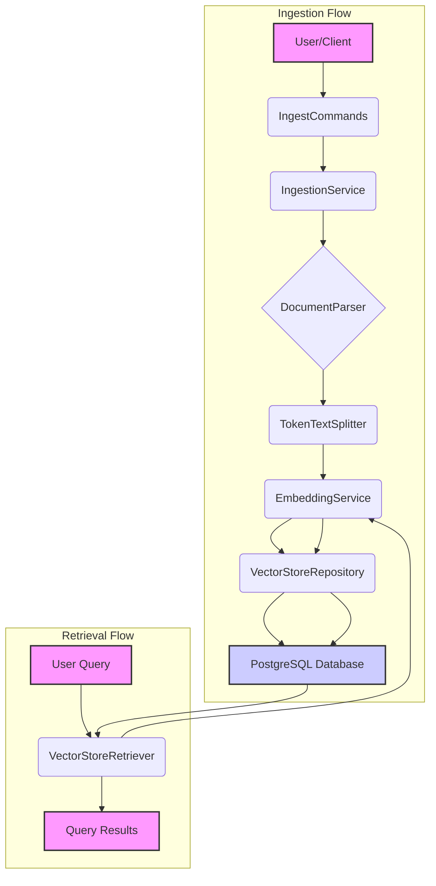

# Spring AI RAG Example

## Overview

This project demonstrates a Retrieval-Augmented Generation (RAG) system using Spring AI, PostgreSQL with `pgvector` for vector storage, and various parsing mechanisms. The core idea is to ingest documents, convert them into embeddings, store them, and then retrieve relevant document segments based on a user query.

## Features

*   **Document Ingestion**: Parse and ingest various document types (e.g., HTML) into the vector store.
*   **Content Hashing**: Ensures idempotency for ingested documents.
*   **Text Chunking**: Splits large documents into smaller, manageable segments for embedding.
*   **Vector Embeddings**: Generates numerical representations (embeddings) of text content using Spring AI's `EmbeddingService`.
*   **Vector Storage**: Utilizes PostgreSQL with the `pgvector` extension for efficient storage and similarity search of vector embeddings.
*   **Document Retrieval**: Finds the most semantically similar document segments to a given query, with support for metadata filtering.

## Architecture

The system is composed of several key components that work together to handle document ingestion and retrieval.



### Component Breakdown:

*   **`IngestCommands`**: A Spring Shell component that provides command-line interface for initiating document ingestion.
*   **`IngestionService`**: Orchestrates the ingestion process. It selects the appropriate `DocumentParser`, chunks the content, generates embeddings, and stores them.
*   **`DocumentParser`**: An interface (with implementations like `HtmlJsoupParser`) responsible for extracting text and metadata from raw documents.
*   **`TokenTextSplitter`**: A utility (from Spring AI) that breaks down large text into smaller, overlapping chunks suitable for embedding.
*   **`EmbeddingService`**: An interface (from Spring AI) that generates vector embeddings for text. This project uses a mock implementation for development and can be configured for providers like OpenAI.
*   **`VectorStoreRepository`**: An interface (with implementations like `PostgresVectorStore`) defining operations for storing and retrieving document segments and their embeddings.
*   **`PostgresVectorStore`**: The concrete implementation that interacts with a PostgreSQL database configured with the `pgvector` extension.
*   **`VectorStoreRetriever`**: Takes a user query, generates its embedding, and queries the `VectorStoreRepository` to find the most relevant document segments.
*   **`PostgreSQL Database`**: The persistent storage for document segments, metadata, and their vector embeddings.

## Getting Started

### Prerequisites

*   Java 17 or higher
*   Maven
*   Docker (for easy PostgreSQL setup)
*   A running PostgreSQL instance with the `pgvector` extension enabled.

### Database Setup (using Docker)

1.  **Start PostgreSQL with `pgvector`**:
    ```bash
    docker run --name pgvector-db -e POSTGRES_PASSWORD=mysecretpassword -p 5432:5432 -d pgvector/pgvector:pg16
    ```
2.  **Connect to the database and enable `pgvector`**:
    ```bash
    docker exec -it pgvector-db psql -U postgres -d postgres
    ```
    Inside `psql`, run:
    ```sql
    CREATE EXTENSION IF NOT EXISTS vector;
    CREATE DATABASE rag_db;
    \c rag_db;
    -- Run your schema.sql and new.sql here
    \i /path/to/your/sql/schame.sql
    \i /path/to/your/sql/new.sql
    ```
    (Note: You'll need to copy your `sql` directory into the container or adjust the paths.)

    Alternatively, you can run the SQL scripts directly from your host machine after the database is up:
    ```bash
    psql -h localhost -p 5432 -U postgres -d rag_db -f sql/schame.sql
    psql -h localhost -p 5432 -U postgres -d rag_db -f sql/new.sql
    ```

### Application Configuration

Edit `src/main/resources/application.yaml` to match your PostgreSQL database credentials and other settings.

```yaml
# ...
spring:
  datasource:
    url: jdbc:postgresql://localhost:5432/rag_db
    username: postgres # Your database username
    password: mysecretpassword # Your database password
# ...
embedding-service:
  provider: "mock" # Change to "openai" for production and configure API key
  dimensions: 1536 # Must match your embedding model
# ...
```

### Running the Application

1.  **Build the project**:
    ```bash
    mvn clean install
    ```
2.  **Run the Spring Boot application**:
    ```bash
    java -jar Template4springAi/target/Template4springAi-0.0.1-SNAPSHOT.jar
    ```
    This will start the Spring Shell application.

## Usage

Once the application is running, you will be in the Spring Shell prompt.

### Ingesting Documents

Use the `ingest` command to add documents to your vector store.

```bash
spring-ai-rag> ingest --path /path/to/your/document.html
```
Replace `/path/to/your/document.html` with the actual path to the file you want to ingest. The system currently supports HTML files via `HtmlJsoupParser`.

### Document Retrieval

Document retrieval is handled internally by the `VectorStoreRetriever` service. You would typically integrate this service into other parts of your application (e.g., a REST endpoint or another shell command) to perform queries against the vector store.

## Contributing

Feel free to fork the repository, open issues, and submit pull requests.

## License

This project is licensed under the MIT License.